<h1 align="center">
  InfraRisk AI
</h1>

<h3 align="center">
  Intelligent Infrastructure Finance Risk Intelligence Platform
</h3>

> AI-driven infrastructure finance analytics platform integrating portfolio stress testing, geospatial intelligence, simulation-based forecasting, contract NLP, and quantitative risk modelling.


---

# Overview

InfraRisk AI is a multi-modal infrastructure finance intelligence platform designed for:

- Infrastructure project finance analytics
- Portfolio stress testing
- Credit risk assessment
- Infrastructure monitoring
- Monte Carlo simulation
- Contract intelligence
- Sovereign infrastructure analytics

The platform combines AI/ML, financial engineering, geospatial analytics, simulation systems, and NLP-based contract intelligence into a unified infrastructure decision-support ecosystem.

---

<p align="center">
  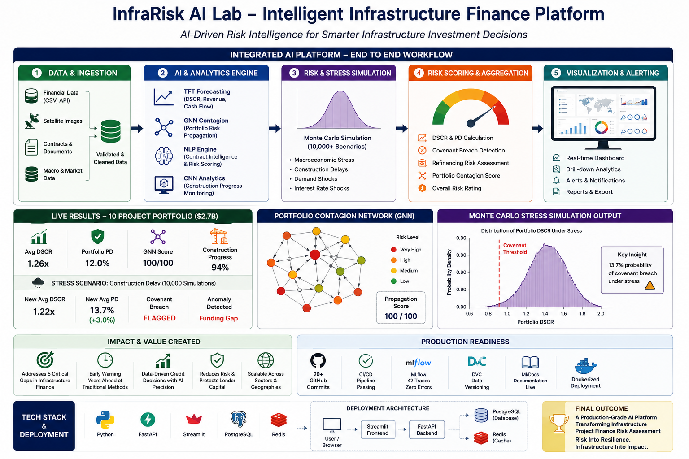
</p>

<p align="center">
  <b>AI-Driven Risk Intelligence for Smarter Infrastructure Investment Decisions</b>
</p>

---


# Core Features

| Feature | Description |
|---|---|
|  DSCR Forecasting | AI-powered debt service coverage forecasting |
|  Portfolio Stress Testing | Monte Carlo simulation-based infrastructure stress testing |
|  Contract Intelligence | Legal-BERT powered contract analytics |
|  Satellite Monitoring | Construction monitoring using CNN architectures |
|  GNN Contagion Analysis | Infrastructure portfolio dependency modelling |
|  Risk Aggregation | Integrated infrastructure risk scoring |
|  Covenant Breach Detection | Automated covenant risk identification |
|  FastAPI APIs | Backend analytics and export endpoints |
|  Interactive Dashboard | Streamlit-based infrastructure intelligence dashboard |
|  MLflow Tracking | Experiment and model monitoring |
|  Docker Deployment | Containerized infrastructure deployment |
|  MkDocs Documentation | Technical documentation and reports |

---

# System Architecture

```text
                        ┌─────────────────────────┐
                        │   User / Risk Analyst   │
                        └────────────┬────────────┘
                                     │
                                     ▼
                    ┌────────────────────────────────┐
                    │      Streamlit Dashboard       │
                    │ Portfolio + Simulation UI      │
                    └────────────────┬───────────────┘
                                     │
                                     ▼
                    ┌────────────────────────────────┐
                    │        FastAPI Backend         │
                    │   API + Risk Engine Layer      │
                    └────────────────┬───────────────┘
                                     │
          ┌──────────────────────────┼──────────────────────────┐
          ▼                          ▼                          ▼

 ┌────────────────┐      ┌────────────────────┐      ┌─────────────────┐
 │ AI/ML Models   │      │ Monte Carlo Engine │      │ NLP Intelligence│
 │ TFT / CNN /    │      │ Stress Simulation  │      │ Legal-BERT      │
 │ GNN / PINN     │      │ Portfolio Risk     │      │ Clause Analysis │
 └────────────────┘      └────────────────────┘      └─────────────────┘
                                     │
                                     ▼
                    ┌────────────────────────────────┐
                    │ SQLite / PostgreSQL Storage    │
                    └────────────────────────────────┘
```
---

# Dashboard Overview

<p align="center">
  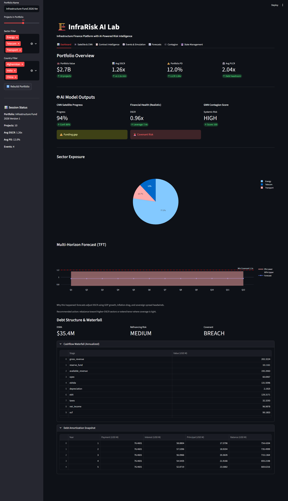
</p>

The dashboard provides:
- Portfolio-wide monitoring
- Infrastructure exposure tracking
- Financial health analytics
- AI-generated forecasts
- Sector concentration analysis
- Debt waterfall visualization

---

# Satellite & CNN Construction Monitoring

<p align="center">
  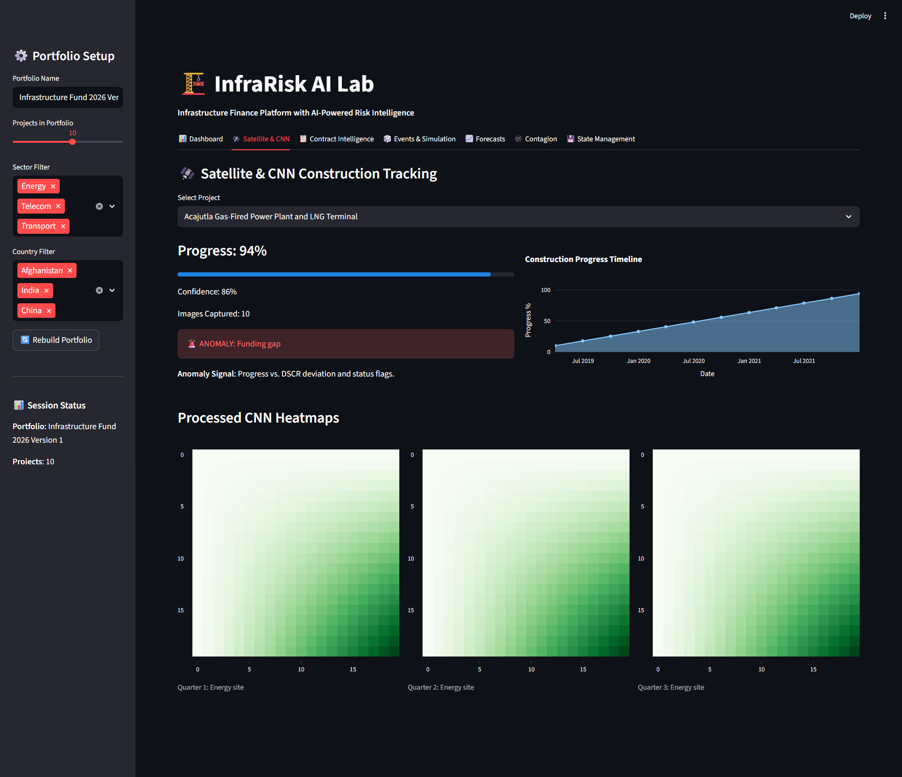
</p>

The platform simulates:
- Satellite-based construction tracking
- CNN heatmap generation
- Infrastructure anomaly detection
- Construction progress intelligence
- Funding gap monitoring

---

# Contract Intelligence & NLP Analysis

<p align="center">
  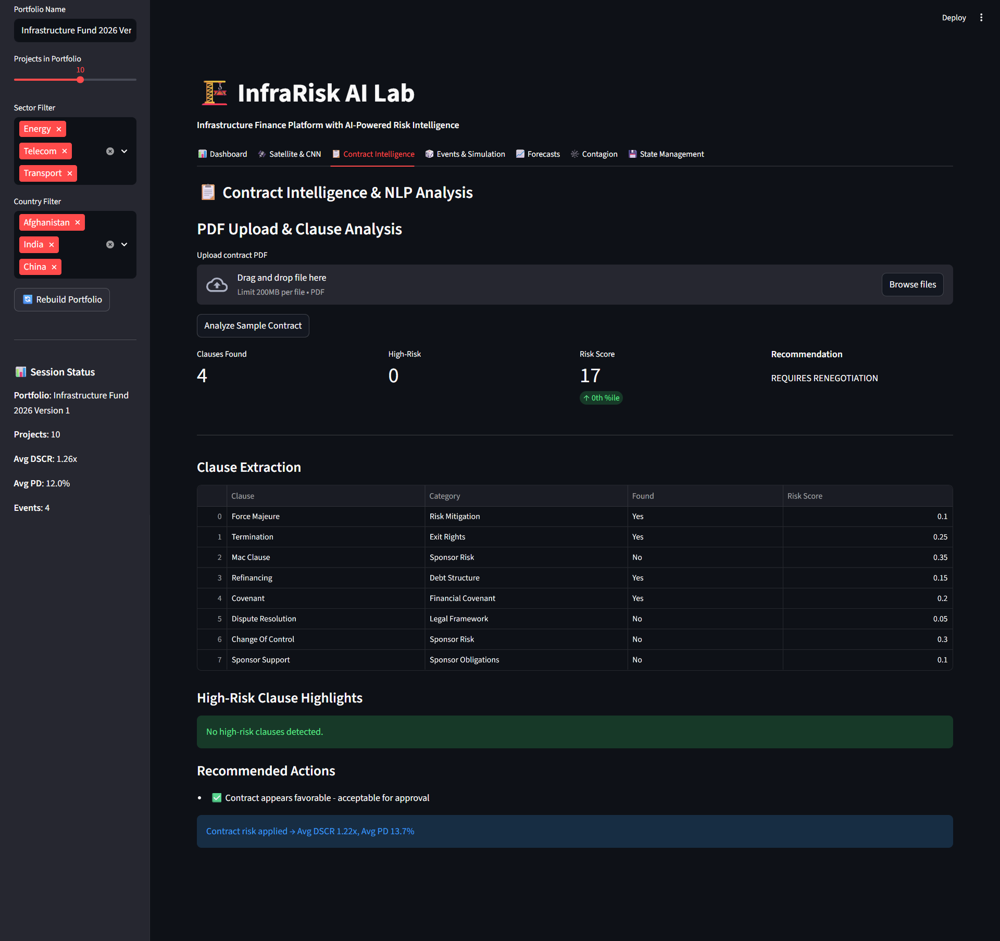
</p>

The NLP engine supports:
- Contract PDF parsing
- Clause extraction
- Legal risk scoring
- Covenant analysis
- Recommendation workflows

---

# Event Simulation & Stress Testing

<p align="center">
  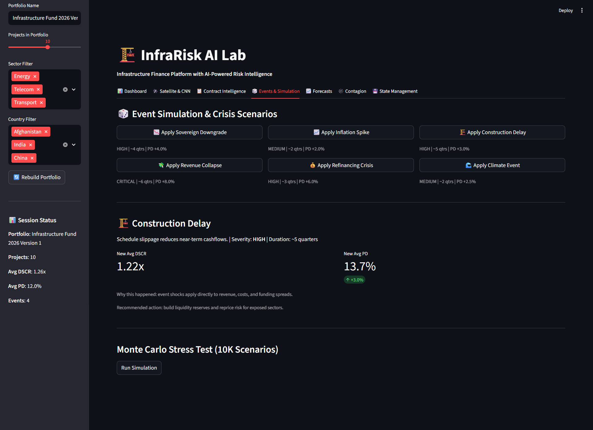
</p>

Simulation capabilities include:
- Sovereign downgrade events
- Inflation shocks
- Revenue collapse scenarios
- Construction delays
- Climate risk events
- Refinancing crises

---

# Forecasting Engine

<p align="center">
  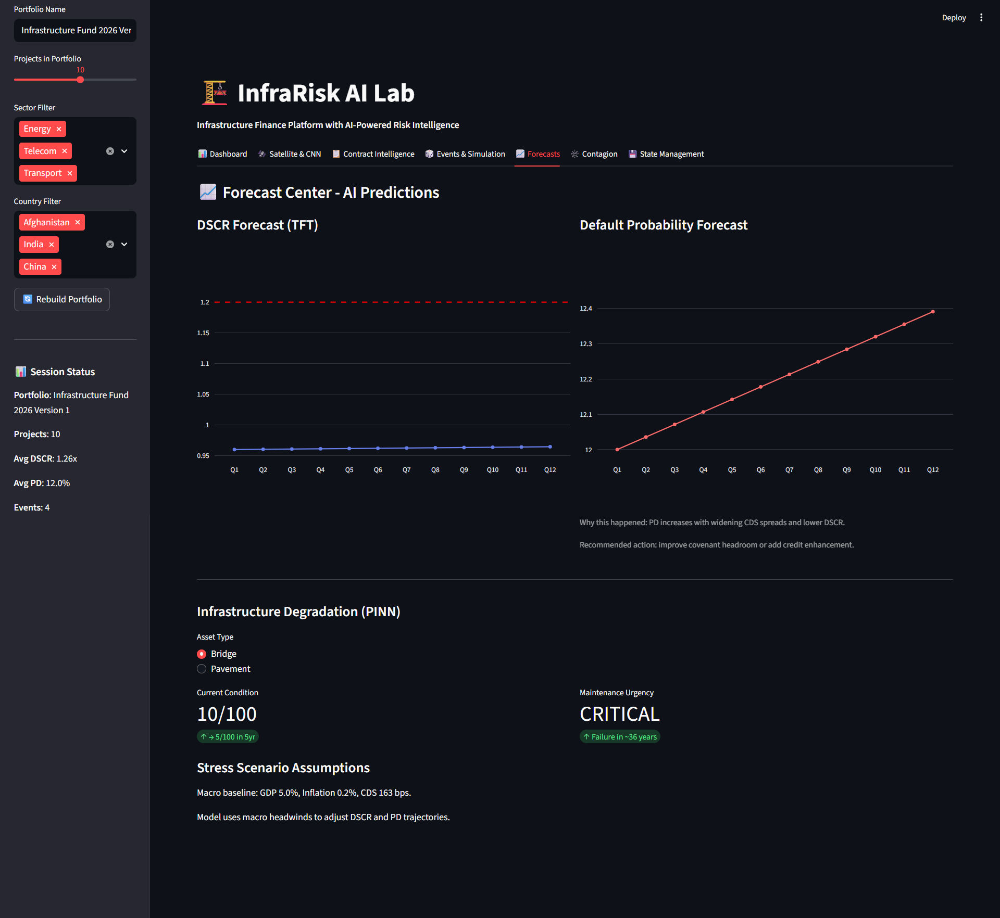
</p>

Forecasting modules provide:
- DSCR prediction
- PD forecasting
- Infrastructure degradation analysis
- Scenario-adjusted forecasting
- Financial trajectory simulation

---

# Portfolio Contagion Analysis

<p align="center">
  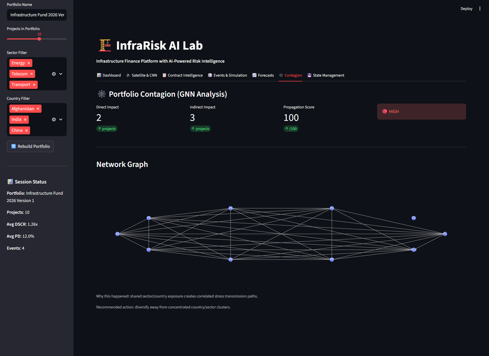
</p>

The contagion engine models:
- Cross-project systemic exposure
- Infrastructure network propagation
- Concentration risk
- Sector interdependencies
- Portfolio contagion scoring

---

# Portfolio Persistence & State Management

<p align="center">
  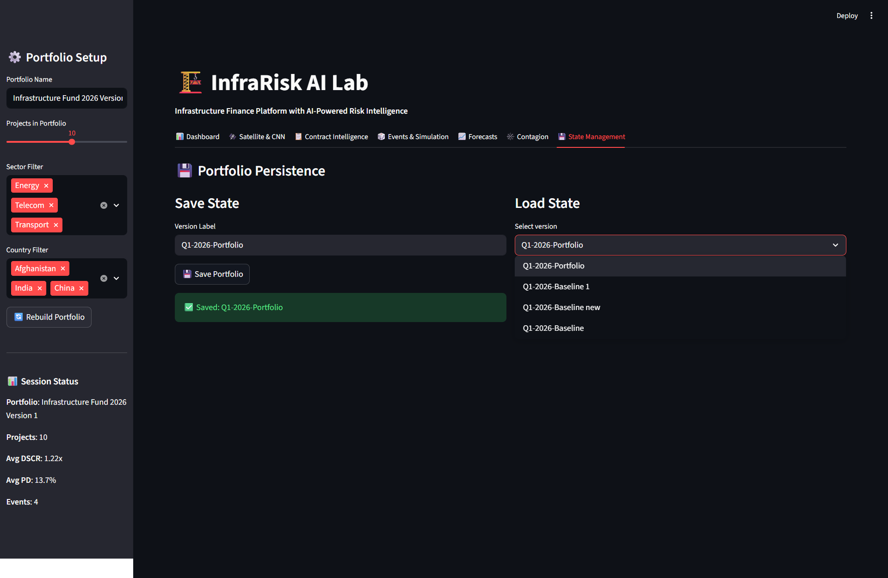
</p>

The platform supports:
- Portfolio persistence
- Scenario versioning
- State restoration
- Simulation history management
- Session tracking

---

# MkDocs Documentation Portal

<p align="center">
  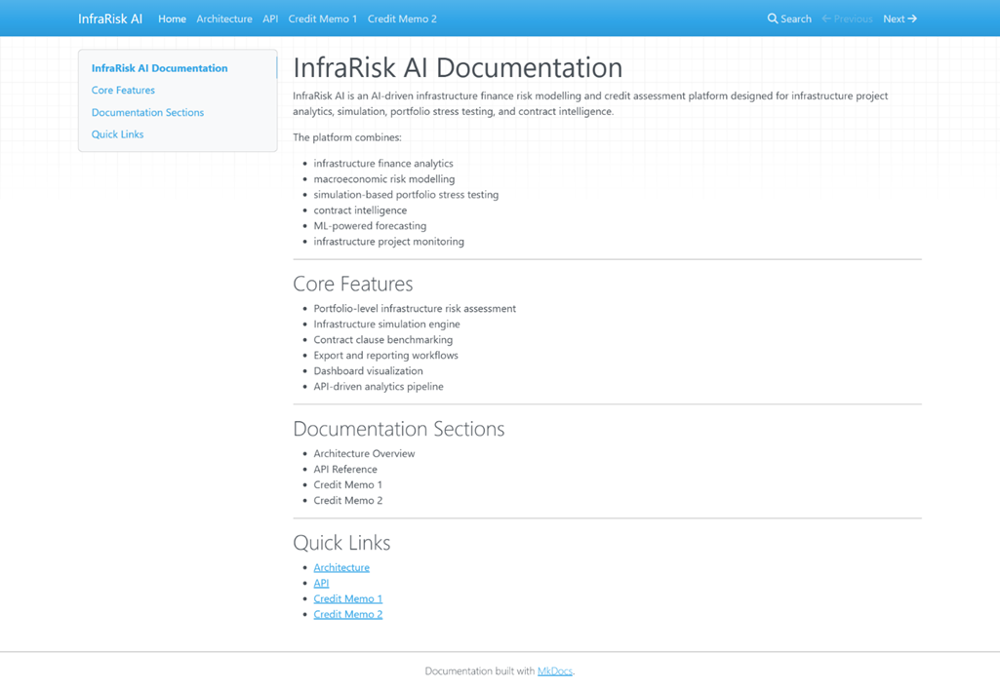
</p>

Documentation includes:
- Architecture overview
- API reference
- Credit memos
- Deployment notes
- Workflow explanations

---

# Docker Deployment

<p align="center">
  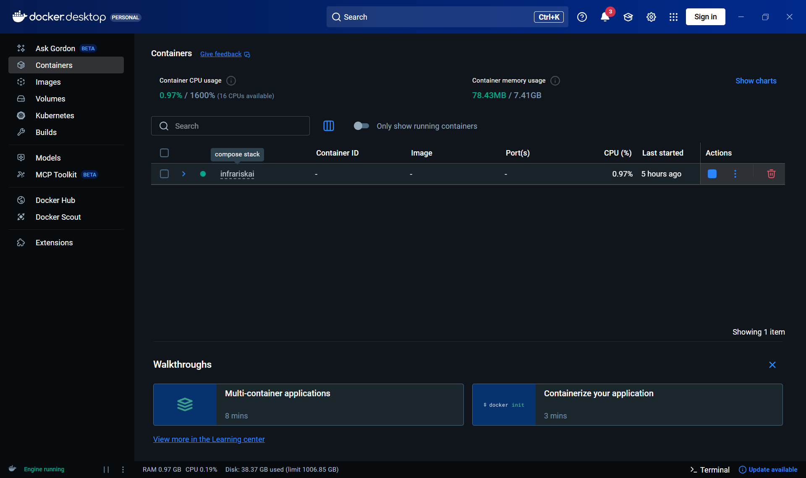
</p>

InfraRisk AI supports reproducible deployment using:
- Docker
- Docker Compose
- Containerized infrastructure workflows

---

# MLflow Integration

<p align="center">
  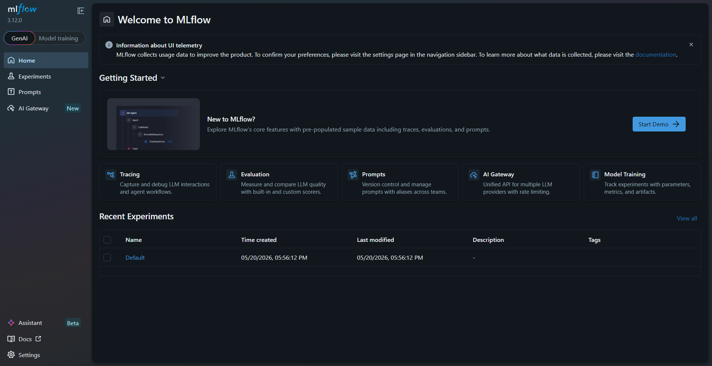
</p>

MLflow integration enables:
- Experiment tracking
- Metric visualization
- Model workflow logging
- Reproducible AI experimentation

---

#  AI/ML Modules

| Module | Purpose |
|---|---|
| TFT Forecasting | Revenue & DSCR prediction |
| Graph Neural Networks | Portfolio contagion modelling |
| Siamese CNN | Satellite construction monitoring |
| PINNs | Infrastructure degradation forecasting |
| Legal-BERT NLP | Contract clause intelligence |
| XGBoost Ensemble | Infrastructure credit risk scoring |

---

#  Dashboard Modules

- Portfolio Analytics
- Monte Carlo Stress Testing
- GNN Contagion Visualization
- Contract Intelligence
- Infrastructure Monitoring
- Export & Reporting
- Scenario Simulation
- Portfolio Benchmarking

---

#  Technology Stack

| Layer | Technologies |
|---|---|
| Frontend | Streamlit, Plotly |
| Backend | FastAPI, Uvicorn |
| ML/DL | PyTorch, Transformers, XGBoost, LightGBM |
| NLP | spaCy, Legal-BERT, LayoutLM |
| Geospatial | rasterio, geopandas |
| Database | SQLite, PostgreSQL |
| MLOps | MLflow, DVC |
| DevOps | Docker, GitHub Actions |
| Documentation | MkDocs Material |
| Testing | pytest, pytest-cov |

---

#  Repository Structure

```bash
InfraRiskAI
├── apps/
│   └── dashboard_v2_complete.py
│
├── assets/
│   ├── architecture.png
│   ├── dashboard_overview.png
│   ├── contagion.png
│   ├── contract_nlp.png
│   ├── forecasting.png
│   ├── satellite_cnn.png
│   ├── simulation.png
│   ├── state_management.png
│   ├── docker.png
│   └── mlflow.png
│
├── configs/
│   ├── .coveragerc
│   ├── .dockerignore
│   ├── .env.example
│   └── pytest.ini
│
├── data/                  # DVC tracked datasets
├── docs/                  # MkDocs documentation
├── deliverables/          # Requirements & project deliverables
├── notebooks/             # Research and experimentation
├── scripts/               # Utility and validation scripts
│
├── src/
│   ├── core/
│   ├── models/
│   ├── nlp/
│   ├── p3/
│   ├── p5/
│   └── setup/
│
├── tests/
│   ├── test_final_engine.py
│   ├── test_models.py
│   ├── test_nlp.py
│   ├── test_phase2_features.py
│   ├── test_phase3_models.py
│   └── test_phase4_integration.py
│
├── tools/
│
├── .dvc/
├── .github/
│   └── workflows/
│
├── backend.Dockerfile
├── docker-compose.yml
├── mkdocs.yml
├── data.dvc
├── requirements.txt
├── README.md
└── QUICKSTART.md
```

---

#  API Endpoints

## Health
- `GET /health`

---

## Portfolio
- `GET /portfolio/demo`
- `POST /portfolio/recalculate`
- `GET /portfolio/runs`

---

## Contracts
- `POST /contract/benchmark`
- `POST /contract/resolve-clauses`

---

## Export
- `POST /export/csv`
- `POST /export/pdf`

---

#  Getting Started

## Clone Repository

```bash
git clone https://github.com/Kritvi0208/InfraRisk.git
cd InfraRisk
```

---

#  Install Dependencies

```bash
pip install -r requirements-app.txt
pip install -r requirements_ml.txt
pip install -r requirements_nlp.txt
```

---

#  Run Dashboard

```bash
streamlit run dashboard_v2_complete.py
```

Dashboard:

```text
http://localhost:8501
```

---

#  Run FastAPI Backend

```bash
uvicorn src.core.api_server:app --reload
```

Backend:

```text
http://127.0.0.1:8000
```

---

#  Run Documentation

```bash
mkdocs serve
```
---

#  MLflow Tracking

Launch MLflow:

```bash
mlflow ui
```

MLflow:

```text
http://127.0.0.1:5000
```

Features:
- Experiment tracking
- Metrics logging
- Artifact storage
- Model monitoring

---

#  Docker Deployment

Run complete infrastructure stack:

```bash
docker-compose up --build
```

Docker services:
- Streamlit Dashboard
- FastAPI Backend
- PostgreSQL
- Redis
- MLflow Tracking

---

#  DVC Data Versioning

Pull tracked datasets:

```bash
dvc pull
```

---

#  Testing

Run tests:

```bash
pytest
```

Coverage:

```bash
pytest --cov
```

---

#  Infrastructure Risk Workflow

```text
Financial Data + Contracts + Satellite Data
                    │
                    ▼
          AI Risk Intelligence Pipeline
                    │
                    ▼
      Forecasting + Stress Simulation
                    │
                    ▼
        Portfolio Risk Aggregation
                    │
                    ▼
       Dashboard + Export Reports
```

---

#  Real-World Use Cases

- Infrastructure project finance
- PPP concession analytics
- Sovereign infrastructure monitoring
- Construction delay forecasting
- Climate stress testing
- Infrastructure refinancing risk
- Contract intelligence automation

---

#  Documentation

MkDocs documentation includes:

- Architecture Overview
- API Reference
- Technical Stack
- Credit Memo 1
- Credit Memo 2
- Deployment Workflow
- Infrastructure Analytics

---

#  References

- World Bank Infrastructure Data
- IMF Macroeconomic Indicators
- Sentinel-2 Satellite Imagery
- Moody’s Infrastructure Finance Studies
- OECD Infrastructure Reports

---

#  Project Information

| Field | Details |
|---|---|
| Project | InfraRisk AI |
| Organization | Zetheta Algorithms Pvt. Ltd. |
| Domain | Infrastructure Finance + AI/ML |
| Category | Data Science / Deep Learning |
| Duration | 15-Day AI Engineering Sprint |

---

# Author

## Ritvika

Data Science & Machine Learning Enthuaist

GitHub:
https://github.com/Kritvi0208

---
